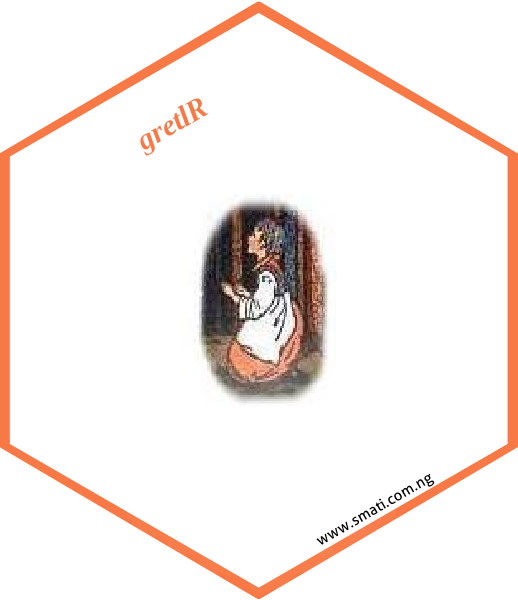

gretlR: A Seamless Integration of Gretl and R
================
Sagiru Mati (PhD)

#  

<!-- badges: start -->
[](https://cran.r-project.org/package=gretlR)
[](https://cranlogs.r-pkg.org/badges/grand-total/gretlR?color=49C31B)
[](https://cranlogs.r-pkg.org/badges/gretlR?color=49C31B)

<!-- badges: end -->


# About gretlR

gretlR is an R package that can run `gretl` program from R, R Markdown and Quarto.

# Installation

gretlR can be installed using the following commands in R.

``` r
install.packages("gretlR")

          OR
          
devtools::install_github('sagirumati/gretlR')
```

# Usage

Please load the gretlR package as follows:

    ```{r gretlR}                                                             
    library(gretlR)
    ```

Then create a chunk for `gretl` as shown below:

    ```{gretl gretlR,eval=T,echo=T,comment=NULL} 
    nulldata 500
    set seed 13
    gretl1 = normal()
    gretl2 = normal()
    setobs 12 1980:01 --time-series
    gnuplot gretl1 --time-series --with-lines --output="line.png"
    gnuplot gretl2 gretl1 --output="scatter.png"
    ols gretl1 const gretl2
    modeltab add
    tabprint --output="olsTAble.Rmd"
    tabprint --output="olsTable.tex"
    tabprint --output="olsTAble.csv"
    eqnprint --output="olsEquation.tex"
    ```  

The above chunk creates a gretl program with the chunk’s content, then
automatically run the gretl script, which will save gretl outputs in the
new folder `gretlR` created in the current working directory.

# include_graph function

We can *dynamically and reproducibly* fetch the `gretl` graph object we
created with the `gretl` chunk using the following R chunk:

For the scatter graph:

``` r
include_graph(chunk = "gretlR",graph = "scatter.png")
```

<br><br><br><br>

or the line graph:

``` r
include_graph(chunk = "gretlR",graph = "line.png")
```

# include_tex function

we can also include the equation of the OLS generated by the `gretl`
chunk and save as `olsEquation.tex`.

If the output is `pdf`, one can use the raw `LaTeX` codes as follows:

`\input{gretlr/gretlR/olsEquation.tex}`

Or use `include_tex` function to include the equation as shown below:

``` r
include_tex(chunk = "gretlR",tex = "olsEquation")
```

``` r
include_tex(chunk = "gretlR",tex = "olsTAble",start = 7,end = 24)
```

<br><br><br><br>

The OLS table output is saved by the `gretl` chunk as `olsTable.Rmd`.
The entire OLS table output can included as child document as follows:

    ```{r child, child='gretlr/gretlR/olsTable.Rmd'} 

    ```

# import_kable function

The `gretl` chunk also saves the OSL table as `olsTable.csv`. The
`import_kable` function can be used to import it as a table. further
customisation can be done with `kableExtra` package.

``` r
import_kable(chunk = "gretlR",file = "olsTAble.csv",caption="Table generated from gretl 
             chunk", start=3,end=7,digits=2) |> 
kableExtra::kable_styling(latex_options = c("basic","hold_position","scale_down")) |> 
 kableExtra::row_spec(0,bold=T)
```

# write_inp function

This function writes `gretl` file.

``` r
code=r'(nulldata 500
set seed 13
gretl1 = normal()
gretl2 = normal()
setobs 12 1980:01 --time-series
gnuplot gretl1 --time-series --with-lines --output="line.png"
gnuplot gretl2 gretl1 --output="scatter.png"
)'

write_inp(code,path="gretlCodes")
```

# exec_inp function

This function executes existing `gretl` files.

``` r
code=r'(nulldata 500
set seed 13
gretl1 = normal()
gretl2 = normal()
setobs 12 1980:01 --time-series
gnuplot gretl1 --time-series --with-lines --output="line.png"
gnuplot gretl2 gretl1 --output="scatter.png"
 )'
write_inp(code,path="SomeFolder/gretlCodes")
exec_inp("someFolder/gretlCodes")
```

# exec_gretl function

This function creates `gretl`file from R object or a set of character
strings and executes it. It is a combination of `write_inp` and
`exec_inp` functions.

``` r
code=r'(nulldata 500
set seed 13
gretl1 = normal()
gretl2 = normal()
setobs 12 1980:01 --time-series
gnuplot gretl1 --time-series --with-lines --output="line.png"
gnuplot gretl2 gretl1 --output="scatter.png"
 )'
exec_gretl(code)
```

# Demo

Demo can be accessed via `demo(package="gretlR")`.

``` r
demo(exec_inp) 
demo(write_inp)
demo(exec_gretl)
```

# R Markdown template

The R Markdown template for the `gretlR` can be accessed via
`file -> New File -> R Markdown -> From Template -> gretlR`

# Similar Packages

Similar packages include
[EviewsR](https://github.com/sagirumati/EviewsR) (Mati 2022b, 2020b,Mati,
Civcir, and Abba 2023),
[DynareR](https://github.com/sagirumati/gretlR) (Mati 2020a, 2022a), and
[URooTab](https://github.com/sagirumati/URooTab) (Mati 2023b, 2023a)

For further details, consult Mati 2020c and 2022c.


<br><br><br><br>

Please download a set of example files from
[Github](https://github.com/sagirumati/gretlR/tree/master/inst/examples/).

# References

Mati, Sagiru. 2020a. “DynareR: Bringing the Power of Dynare to
<span class="nocase">R, R Markdown, and Quarto</span>.” *CRAN*.
<https://CRAN.R-project.org/package=DynareR>.

———. 2020b. *EviewsR: A Seamless Integration of EViews and R*.
<https://CRAN.R-project.org/package=EviewsR>.

———. 2020c. *gretlR: A Seamless Integration of Gretl and R*.
<https://CRAN.R-project.org/package=gretlR>.

———. 2021. “Do as Your Neighbours Do? Assessing the Impact of Lockdown
and Reopening on the Active COVID-19 Cases in Nigeria.” *Social Science
&Amp; Medicine* 270 (February): 113645.
<https://doi.org/10.1016/j.socscimed.2020.113645>.

———. 2022a. “Package ‘DynareR’.”
<https://cran.r-project.org/web/packages/DynareR/DynareR.pdf>.

———. 2022b. “Package ‘EviewsR’.”
<https://cran.r-project.org/web/packages/EviewsR/EviewsR.pdf>.

———. 2022c. “Package ‘gretlR’.”
<https://cran.r-project.org/web/packages/gretlR/gretlR.pdf>.

———. 2023a. “Package ‘URooTab’.”
<https://cran.r-project.org/web/packages/URooTab/URooTab.pdf>.

———. 2023b. *URooTab: Tabular Reporting of EViews Unit Root Tests*.
<https://github.com/sagirumati/URooTab>.

Mati, Sagiru, Irfan Civcir, and S. I. Abba. 2023. “EviewsR: An r Package
for Dynamic and Reproducible Research Using EViews, r, r Markdown and
Quarto.” *The R Journal* 15 (2): 169–205.
<https://doi.org/10.32614/rj-2023-045>.

Mati, Sagiru, Irfan Civcir, and Hüseyin Ozdeser. 2019. “ECOWAS COMMON
CURRENCY: HOW PREPARED ARE ITS MEMBERS?” *Investigación Económica* 78
(308): 89. <https://doi.org/10.22201/fe.01851667p.2019.308.69625>.

Mati, Sagiru, Irfan Civcir, and Hüseyin Özdeşer. 2023. “ECOWAS Common
Currency, a Mirage or Possibility?” *Panoeconomicus* 70 (2): 239–60.
<https://doi.org/10.2298/pan191119015m>.

Mati, Sagiru, Magdalena Radulescu, Najia Saqib, Ahmed Samour, Goran
Yousif Ismael, and Nazifi Aliyu. 2023. “Incorporating Russo-Ukrainian
War in Brent Crude Oil Price Forecasting: A Comparative Analysis of
ARIMA, TARMA and ENNReg Models.” *Heliyon* 9 (11): e21439.
<https://doi.org/10.1016/j.heliyon.2023.e21439>.

