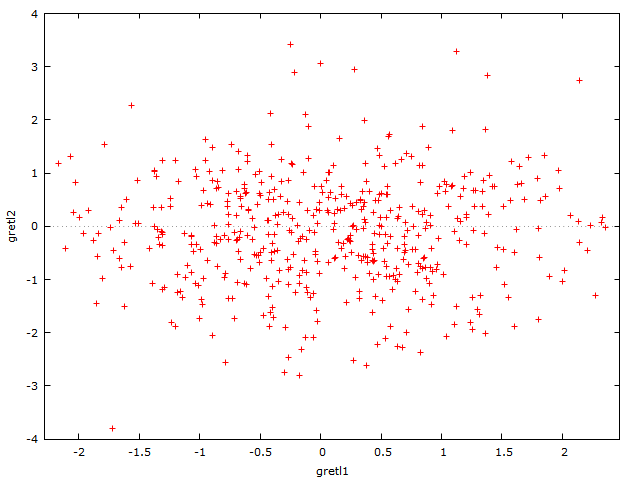
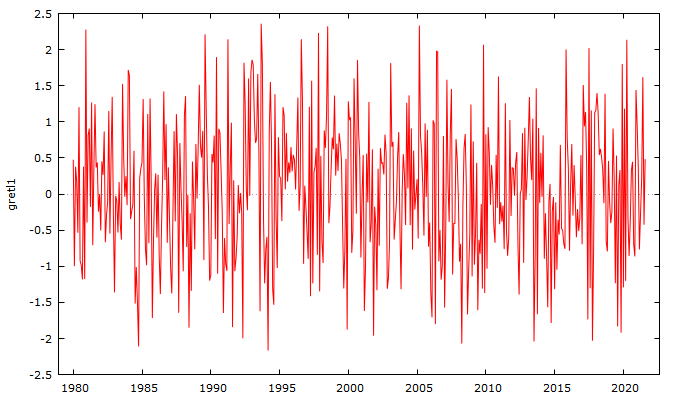

```{r setup, include=FALSE}
knitr::opts_chunk$set(echo = TRUE,comment = NULL)
if(!require(gretlR)) devtools::install_github('sagirumati/gretlR')
library(gretlR)
```

# About gretlR

gretlR is an R package that can run `gretl` program from R Markdown. 


# Installation

gretlR can be installed using the following commands in R.

```{r installation,eval=FALSE}
install.packages("gretlR")

          OR
          
devtools::install_github('sagirumati/gretlR')
```

# Usage

Please load the gretlR package as follows: 

````
```{r gretlR} `r ''`                                                            
library(gretlR)
```
````


Then create a chunk for `gretl` as shown below:

````` 
```{gretl gretlR1,eval=T,echo=T,comment=NULL,results='hide'} `r ''`
nulldata 500
set seed 13
gretl1 = normal()
gretl2 = normal()
setobs 12 1980:01 --time-series
gnuplot gretl1 --time-series --with-lines --output="line.png"
gnuplot gretl2 gretl1 --output="scatter.png"
ols gretl1 const gretl2
modeltab add
tabprint --output="ols.Rmd"
eqnprint --output="olsmodel.Rmd"
tabprint --output="ols.csv"
```  
`````

```{gretl gretlR1,eval=T,echo=F,comment=NULL}
nulldata 500
set seed 13
gretl1 = normal()
gretl2 = normal()
setobs 12 1980:01 --time-series
gnuplot gretl1 --time-series --with-lines --output="line.png"
gnuplot gretl2 gretl1 --output="scatter.png"
ols gretl1 const gretl2
modeltab add
tabprint --output="ols.Rmd"
eqnprint --output="olsmodel.Rmd"
tabprint --output="ols.csv"
```


The above chunk creates an gretl program with the chunk’s content, then
automatically gretl, which will save gretl outputs in the
current directory.

We can *dynamically and reproducibly* fetch the `gretl` graph object we created with the `gretl` chunk using the following R chunk: 

For the scatter graph:

```{r color,echo=T,fig.cap="Scatter graph produced by gretl chunk",out.width='\\textwidth'}
library(knitr)


```


<br><br><br><br>

or the line graph:

```{r nocolor,echo=T,out.width='\\textwidth',fig.cap="Line graph produced by gretl chunk"}


```


we can also include the equation of the OLS generated by the `gretl` chunk using the following R chunk;


<br><br><br><br>

Remember the OLS equation output is saved by the `gretl` chunk as `olsmodel.Rmd`. The entire OLS equation model:

````
```{r child, child='olsmodel.Rmd'} `r ''`

```
````

```{r child, child='olsmodel.Rmd'}

```


<br><br><br><br>

Remember the OLS table output is saved by `gretl` chunk as `ols.Rmd`. The entire OLS table output:


````
```{r child1, child="ols.Rmd"} `r ''`

```
````

```{r child1, child="ols.Rmd"} 

```


<br><br><br><br>


Unfortunately, user of `gretl` has little or no control over the outputs customisation before exporting.


<br><br><br><br>

Please visit my [Github](https://github.com/sagirumati/gretlR/tree/master/inst/examples/) for a better explanation and example files.


